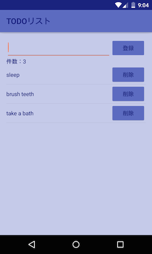

# android-dagger-rxjava-sample

## Use library

- [Dagger 2 (ver 2.0.2)](https://github.com/google/dagger/)
- [android-apt (ver 1.8)](https://bitbucket.org/hvisser/android-apt)
- [RxJava (ver 1.1.0)](https://github.com/ReactiveX/RxJava)
- [RxAndroid (ver 1.1.0)](https://github.com/ReactiveX/RxAndroid)
- [Gradle Retrolambda Plugin (ver 3.2.5)](https://github.com/evant/gradle-retrolambda/)
- [Realm (ver 0.81.1)](https://realm.io/)
- [Butter Knife (ver 7.0.1)](http://jakewharton.github.io/butterknife/)

> This project uses Java8 and [Retrolambda](https://github.com/orfjackal/retrolambda).